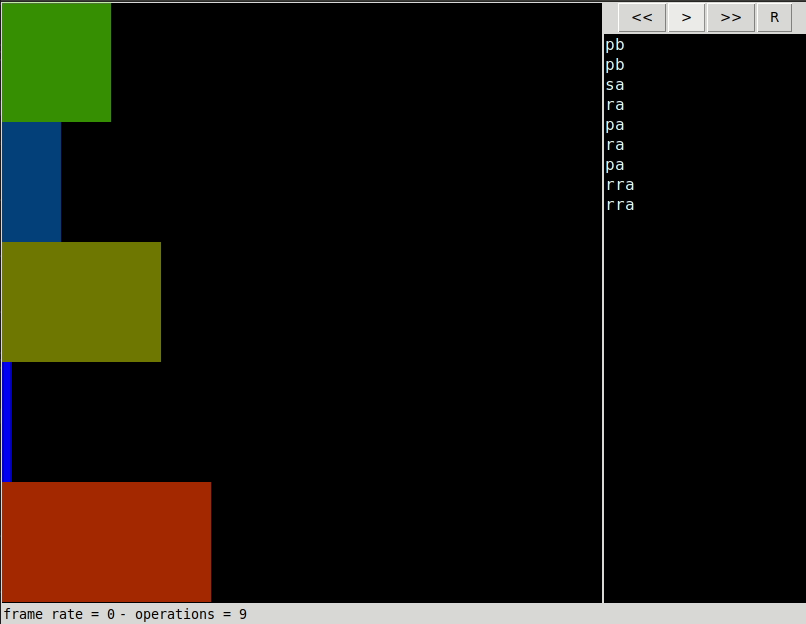
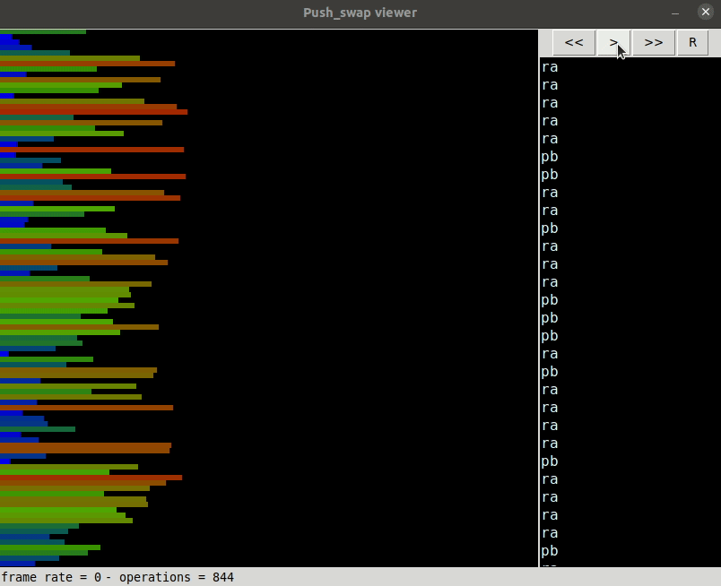

# push\_swap

_Swap push is strange, isn't it???_



## Introduction

This project comprises an interesting case study regarding sorting algorithms and its performances, being part of the core curriculum of all 42 schools worldwide. The task is simple: given a sequence of random numbers disposed in a stack data structure (**stack A**), sort them with the help of an empty auxiliary stack (**stack B**) and a set of specific stack operations. The operations allowed are described as follows, as written in our task:

- **`sa`** : **swap a** - Swap the first 2 elements at the top of stack A. Do nothing if there is only one or no elements).
- **`sb`** : **swap b** - Swap the first 2 elements at the top of stack B. Do nothing if there is only one or no elements).
- **`ss`** : **`sa`** and **`sb`** at the same time.
- **`pa`** : **push a** - take the first element at the top of b and put it at the top of a. Do nothing if B is empty.
- **`pb`** : **push b** - take the first element at the top of a and put it at the top of b. Do nothing if A is empty.
- **`ra`** : **rotate a** - shift up all elements of stack A by 1. The first element becomes the last one.
- **`rb`** : **rotate b** - shift up all elements of stack B by 1. The first element becomes the last one.
- **`rr`** : **`ra`** and **`rb`** at the same time.
- **`rra`** : **reverse rotate a** - shift down all elements of stack A by 1. The last element becomes the first one.
- **`rrb`** : **reverse rotate b** - shift down all elements of stack B by 1. The last element becomes the first one.
- **`rrr`** : **`rra`** and **`rrb`** at the same time.

### The Push Swap Program

The main objective of the `push_swap` is to print to `STDOUT` the instructions required to sort the **stack A**, which must be given as the program's argument. Each instruction must be followed by a line break (`\n`). The **stack A** must be sorted with its lowest element at the top, while **stack B** must be empty.

```shell
$ ARG='4 0 1 3 2'; ./push_swap $ARG

pb
pb
sa
ra
pa
pa
ra
```

### The Checker Program

To help identify if a set of instructions is valid or not, you can run the `checker` program with the same stack as the `push_swap` program. The `checker` program will then accept the sorting instructions on `STDIN`, giving us the result `OK`, if the stack was indeed sorted, or `KO` otherwise.


```shell
$ ARG='4 0 1 3 2'; ./push_swap $ARG | ./checker $ARG

OK
```

Both the `checker` or `push_swap` executables will result in an error if a stack has non-numerical arguments, a number is repeated or if a number is out of the 8-bit integer range.

---

## Compilation

You must have installed `make` and `clang` to compile this project. The execution of the `make` command will generate the binaries for both `checker` and `push_swap` and the libraries needed to the compilation.

---

## Testing

To run the integrated tests, you must have installed the `Python 3.6+`, `perl` and `libipc-run3-perl` packages on your system. The unit tests may be executed by running the `make test` command. To run the simple integrated tests on your system, you can use the `runner.pl` helper script.

```shell
perl runner.pl 100
perl runner.pl 100 --checker
perl runner.pl 100 --count
```

In this example, a stack of 100 random integers is generated, and the `push_swap` command is used to sort the sequence.

- Running the script without arguments will print the instructions to `STDOUT`;
- Running with the `--checker` option will invoke the `checker` program to check if the instructions will sort the stack correctly;
- Running with the `--count` option will count the number of instructions needed to sort the stack with the `wc` program.

The visual tests can be seen with the help of Emmanuel Ruaud testing Python script. His work is truly helpful, and I encourage you to star it at [push_swap_visualizer](https://github.com/o-reo/push_swap_visualizer). To run it, simply run the following command:

```shell
### Change <N> with the stack size to sort

python3 pyviz.py `perl -e "use List::Util 'shuffle'; print join(' ', shuffle(0..(<N> - 1)))"`
```

---

## The Algorithm

I was heavily inspired with the works of Jamie Dawson and Anya Schukin to get to the final version of this project. Let's start with Jamie's article [Push_Swap: The least amount of moves with two stacks](https://medium.com/@jamierobertdawson/push-swap-the-least-amount-of-moves-with-two-stacks-d1e76a71789a), which explains how we can sort a stack with 5 numbers or fewer.

### Sorting of a Small Stack

Given that we have 0 or 1 numbers at the stack, we don't need to do anything, as we can assume that a stack of a single number is already sorted. At 2 numbers, we may have only two scenarios:

1. The stack is already sorted; or
2. if not, swap the numbers of stack A.

When we have 3 numbers, the situation is a little more complex, but it's still easy. In this case, a sequence of 3 numbers only allow `3! = 6` permutations of elements. Given that one these permutations is the sorted sequence, we only have to bother with 5 permutations, each one of them with a different set of instructions required to sort. The details are explained in Jamie's article, and the implementation may be found at the `sort_small.c` source file.

When we have 4 or 5 elements, we just need to push the top two elements to stack B and run the sorting algorithm on the remaining stack. To finish the sorting process, we just need to push the last two or less elements on stack B, finding the correct position on the stack A before running the push operation.

### Sorting of a Large Stack

The former algorithm wasn't able to deal with a large stack, with more than 100 or 500 elements. Therefore, we would need to change our strategy a little bit. First of all, I'd like to cite Anya's work [Push_Swap](https://github.com/anyaschukin/Push_Swap), which is the basis for this section of the project.

The best way to deal with a large number of elements is to split them in smaller chunks. As we have an auxiliary stack to make operations, we could transfer the elements in between of a certain range of minimal and maximal limits, without bothering with their order at this point. After pushing all the elements of a chunk, let's push them back, but at this time, they must be pushed in the correct order. The use of rotation operations is of great importance right now.

Here, it's interesting to have some kind of `smart_rotate` function, which will rotate the stack according to the number we want at the top. This way, we may select the canonical or reverse rotation, and apply the one which will grant us the fewer amount of moves required.

We can then proceed to sort the remaining chunks, until we have the stack A completely sorted. At the end, it's important to move the smaller element with the help of `smart_rotate`.


