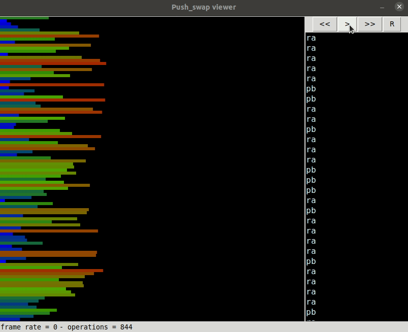

# push\_swap

_Swap push is strange, isn't it???_



## Introduction

This project comprises an interesting case study regarding sorting algorithms and its performances, being part of the core curriculum of all 42 schools worldwide. The task is simple: given a sequence of random numbers disposed in a stack data structure (**stack A**), sort them with the help of an empty auxiliary stack (**stack B**) and a set of specific stack operations. The operations allowed are described as follows, as written in our task:

- **`sa`** : **swap a** - Swap the first 2 elements at the top of stack A. Do nothing if there is only one or no elements).
- **`sb`** : **swap b** - Swap the first 2 elements at the top of stack B. Do nothing if there is only one or no elements).
- **`ss`** : **`sa`** and **`sb`** at the same time.
- **`pa`** : **push a** - take the first element at the top of b and put it at the top of a. Do nothing if B is empty.
- **`pb`** : **push b** - take the first element at the top of a and put it at the top of b. Do nothing if A is empty.
- **`ra`** : **rotate a** - shift up all elements of stack A by 1. The first element becomes the last one.
- **`rb`** : **rotate b** - shift up all elements of stack B by 1. The first element becomes the last one.
- **`rr`** : **`ra`** and **`rb`** at the same time.
- **`rra`** : **reverse rotate a** - shift down all elements of stack A by 1. The last element becomes the first one.
- **`rrb`** : **reverse rotate b** - shift down all elements of stack B by 1. The last element becomes the first one.
- **`rrr`** : **`rra`** and **`rrb`** at the same time.

### The Push Swap Program

The main objective of the `push_swap` is to print to `STDOUT` the instructions required to sort the **stack A**, which must be given as the program's argument. Each instruction must be followed by a line break (`\n`). The **stack A** must be sorted with its lowest element at the top, while **stack B** must be empty.

```shell
$ ARG='4 0 1 3 2'; ./push_swap $ARG

pb
pb
sa
ra
pa
pa
ra
```

### The Checker Program

To help identify if a set of instructions is valid or not, you can run the `checker` program with the same stack as the `push_swap` program. The `checker` program will then accept the sorting instructions on `STDIN`, giving us the result `OK`, if the stack was indeed sorted, or `KO` otherwise.


```shell
$ ARG='4 0 1 3 2'; ./push_swap $ARG | ./checker $ARG

OK
```

Both the `checker` or `push_swap` executables will result in an error if a stack has non-numerical arguments, a number is repeated or if a number is out of the 8-bit integer range.

## Compilation

You must have installed `make` and `clang` to compile this project. The execution of the `make` command will generate the binaries for both `checker` and `push_swap` and the libraries needed to the compilation.

## Testing

To run the integrated tests, you must have installed the `Python 3.6+`, `perl` and `libipc-run3-perl` packages on your system. The unit tests may be executed by running the `make test` command. To run the simple integrated tests on your system, you can use the `runner.pl` helper script.

```shell
perl runner.pl 100
perl runner.pl 100 --checker
perl runner.pl 100 --count
```

In this example, a stack of 100 random integers is generated, and the `push_swap` command is used to sort the sequence.

- Running the script without arguments will print the instructions to `STDOUT`;
- Running with the `--checker` option will invoke the `checker` program to check if the instructions will sort the stack correctly;
- Running with the `--count` option will count the number of instructions needed to sort the stack with the `wc` program.